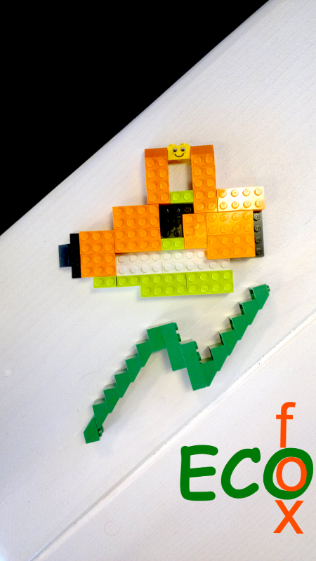

ECOfox
======

FirefoxOS Athens 2013 appdays

<h2>Introduction</h2>
This application is a home power consumption monitor that utilizes the premises ppc power meter to calculate various appliances power consumption without using extra hardware equipment (meters).

<h2>Reasoning</h2>
Measuring power consumption using a power meter can offer great precision, but it comes with various drawbacks:
- the equipment costs money
- one cannot easily measure appliances such as the water heater or the oven

When calculating appliances consumption in order to save power one does not necessarily need decimal precision, but rather a good average for each appliance.

The proposed app will estimate this average for every appliance the user wishes to measure. The reasoning behind the app is the following:

The consumption of each device can be measured within a short period, by monitoring the ppc power meters consumption index, and stored as an appliance consumption profile. Having a complete consumption profile of all the appliances, one can statistically analyze and predict the energy consumption and its allocation to the various devices. This can lead to important energy and cost savings for the households or businesses and can enable the devices efficiency monitoring (including aging factor) and eventually better device use planning.

<h2>Motivation</h2>
During the last decade energy management efforts have mainly concentrated on developing new efficient and environmentally friendly energy sources. Much less attention has been given to reducing energy consumption (and thus monetary and environmental cost) both for the final user and the world as a whole. Moreover, until now the statistical study and profiling of energy consumption on an %quo;end-user level%quo; has been costly, inaccurate and cumbersome. A low cost crowd-sourced method that can offer direct cost benefits to the participants on a large scale, can enable important cost and energy savings on both a large and low level scale. 

<h2>Wireframes</h2>
https://plus.google.com/photos/105097433715685239072/albums/5950916306112219601?authkey=COS2mLDR8OnoLg

<h2>How it works</h2>
Initially the user needs to  and calibrate each one separately. 

The first step of the calibration phase is to estimate the households idle consumption, which is done via the following procedure:
- 
- 
- Press next (starts the timer)
- 
- Press next, input the new reading
- Press finish (stops the timer)

The above procedure will  for the household.

The devices calibration works as follows:
- 
- 
- (timer starts)
- 
- 
- (timer stops)
- 

The estimation of the  is done by subtracting the idle consumption from the newly measured consumption.

This phase is called the devices energy profiling. Once this phase has been completed the user can monitor each device by setting its state (on/off) in the applications Device Use Panel. Whenever a device is turned on, . Accordingly, when the device is not in use its state should be set as inactive.

Through this procedure the application generates a complete household power consumption profile, allocating consumption to the various devices.

The user will be able to review analytic reports about  and cost and accordingly for each device separately. These reports will enable device use planning, energy savings, cost savings.

The devices power profiles can be shared within a community of users as open access data, enabling consumers decision making process, when deciding on which appliances to buy.

<h2>Features</h2>
- real time energy consumption measuring
- appliances energy profiling (efficiency, aging)
- appliances usage / usage cost
- household power consuming profile
- power consuming allocation
- detection of power saving opportunities
- proposals for better power consumption distribution (schemes)
- social sharing of appliances energy profile and best practices

<h2>Additional future features</h2>
- Automatic readings with the use of a mobile-phone web cam (image recognition, calculation of consumption through indicator monitoring)
- Use of app with other utilities (water, gas etc)

